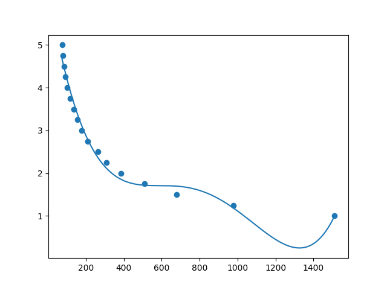
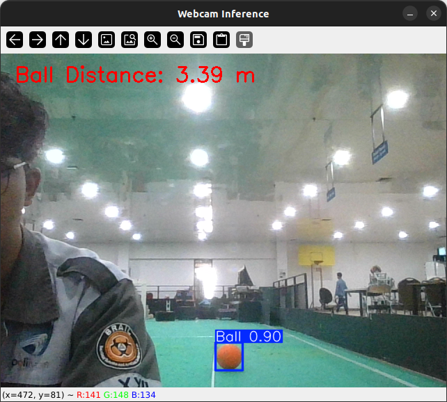

# Distance Prediction using YOLOv11 and Polynomial Regression
This repository presents a project for estimating object distance using YOLOv11 for object detection and polynomial regression. The bounding box area from detected objects serves as the primary input for predicting distances.

## Workflow

1. Object Detection  
The system uses YOLOv11 to detect objects in real-time video frames. For detected objects, the bounding box area (`x`) is computed and used as input for regression. The actual distances (`y`) are pre-defined for training the regression model.

2. Data Processing
* Bounding Box Area (`x`): Calculated as the product of the width and height of the bounding box. This area is normalized by dividing by 10 to ensure manageable values.
* Ground Truth Distance (`y`): Measured distances corresponding to the bounding box area for a specific object (e.g., a ball). These are used to train the polynomial regression model.

4. Distance Estimation  
A polynomial regression model is trained with the bounding box area and corresponding distances. This model predicts the distance of detected objects during real-time inference.

5. Real-Time Prediction  
The system processes video input from a webcam to detect objects and annotate frames with the estimated distance.

## Result

You can visualize the relationship between the bounding box area (`x`) and the object distance (`y`) by running the `poly_plot.py` script. The plot illustrates the polynomial regression curve fitting the given data points.

